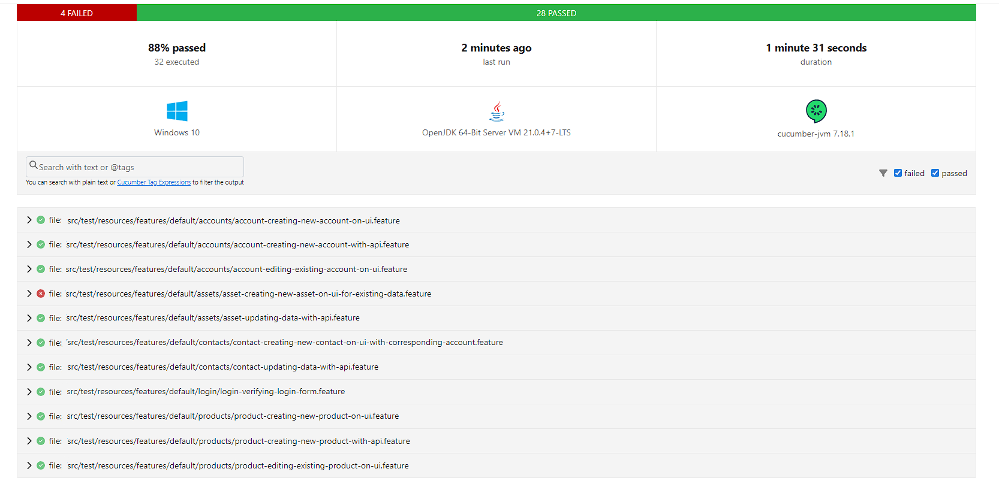

# ☁ Salesforce Java Test Automation Repository
### 🛠️ Created by Sebastian Pigulski

This repository contains suite of automated test scripts designed to validate core [Salesforce](https://www.salesforce.com/eu/?ir=1) functionalities.
It serves as a robust template for building test automation frameworks in Salesforce-driven projects (Chrome web testing),
providing reusable methods for a wide range of interactive actions and seamless communication with Salesforce's (not only) REST API endpoints.
The automation framework leverages industry-used tools and technologies, including Cucumber, Selenium, and TestNG, 
ensuring scalability, flexibility, and maintainability for your Salesforce automation efforts.

## Technology Stack

- **Java 21**: The core language for implementing the test automation.
- **Cucumber**: Behavior-Driven Development (BDD) framework for defining tests in a human-readable format.
- **Selenium**: Web automation tool for interacting with the Salesforce UI.
- **TestNG**: Test execution framework for organizing and running tests.
- **HttpClient**: HTTP client for making REST API calls to Salesforce for backend operations.
- **Log4j**: Logging framework for detailed logging and debugging.
- **DataFaker**: Library used to generate realistic test data for Salesforce records.
- **SnakeYAML**: Library for parsing and writing YAML files, used to manage test configuration and data.
- **Gson**: Library for serializing and deserializing JSON data, essential for handling Salesforce API responses and requests.

For exact versions check pom.xml file :)

## Features

- **Logging in to platform**
- **Salesforce Record Operations in UI & API**:
    - Creating records (e.g., Accounts, Contacts, Products).
    - Updating existing records data.
    - Validating created records via UI.
    - Deleting records from Salesforce.
- **Clean up data scripts**: For removing no longer needed data.
- **Verbose Logging**: Easy to read and containing a lot of information logs e.g. exact date, locators etc.
- **Data-Driven Testing**: Test data generated dynamically using DataFaker.
- **Deployment-ready yaml configuration**: Feature files paths, glue paths and plugins can be easily configured.
- **Data stored in JSON:** Credentials, endpoints, org data, validation messages, data structure is stored in well-known JSON format.

## Design patterns
- Bot Pattern -> Action Bot
- Page Object Model
- Composition
- Selenium PageFactory for locators with no parameters
- Loadable component was considered, but not useful for cucumber which prefers composition approach
- Shared TestContext as singleton

## Prerequisites

- **Java 21**
- **Maven**
- **[Salesforce Developer Edition](https://developer.salesforce.com/signup) Configured**: Users created and connected app access prepared.

## Installation and Setup

1. Clone the repository:
   ```bash
   git clone https://github.com/sebap09/salesforce-java-test-automation-repository
   cd salesforce-java-test-automation-repository
    ```
2. Install the required dependencies by running Maven:
    ```bash
     mvn clean install
    ```
3. Set up src/resources/run-test.yaml file with correct paths for features & glues.
4. Set up the src/resources/data.json:
- adminUser credentials
- salesforceConsumerKey: Connected app key.
- salesforceConsumerSecret: Connected app secret.
- orgId
- environment
- page urls & endpoints
- default dummy data

5. Configure logging levels and output formats in the src/resources/log4j2.properties file.
6. Check tests reliability for specific resolution (from default tests are build for 2560x1440 screen resolution, so for smaller resolution additional scrolls might be needed).

## Running Tests
1. Run Cucumber Tests: You can run the tests using Maven:
    ```bash
     mvn test
    ```
2. Test Reports: Test execution reports are generated in the target folder.

## Contributing
Any contributions are welcome to improve this automation suite. Feel free to open issues and submit pull requests.

## Next focus
- use new Salesforce records
- JSON file split
- soql query generator
- mobile automation with the use of Appium

## Example HTML Report
